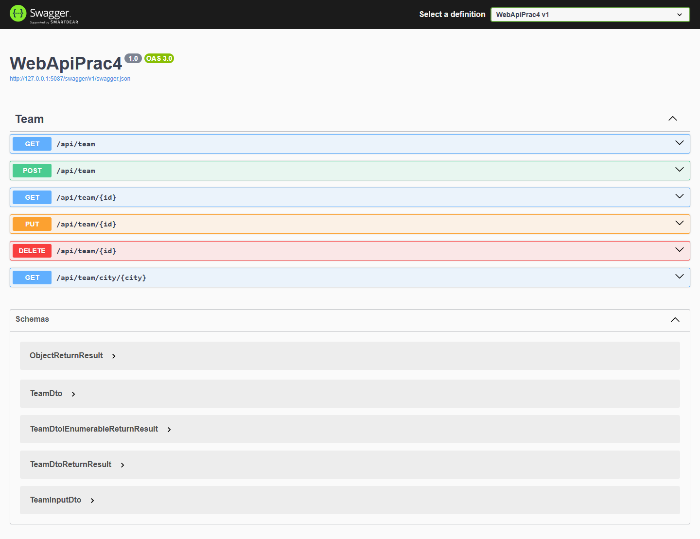
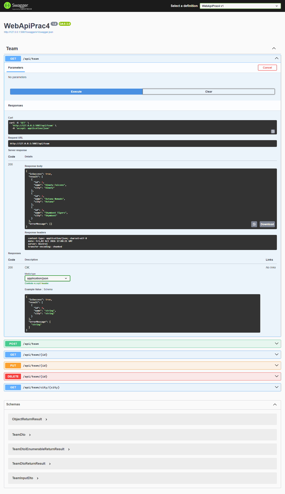
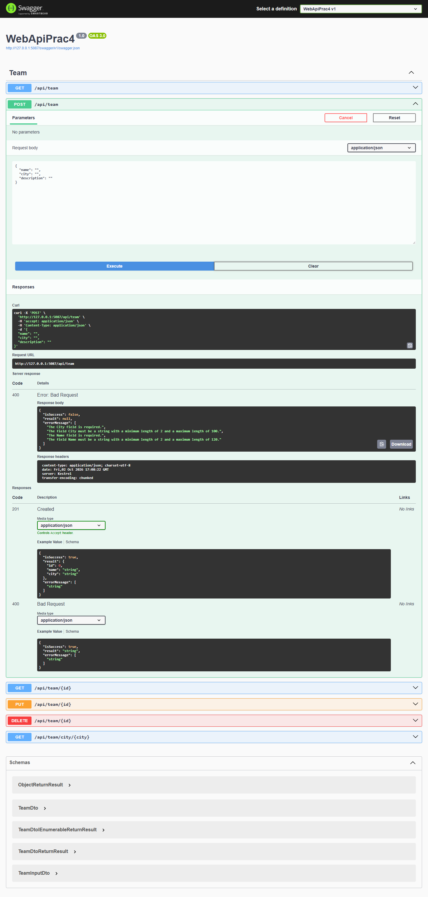
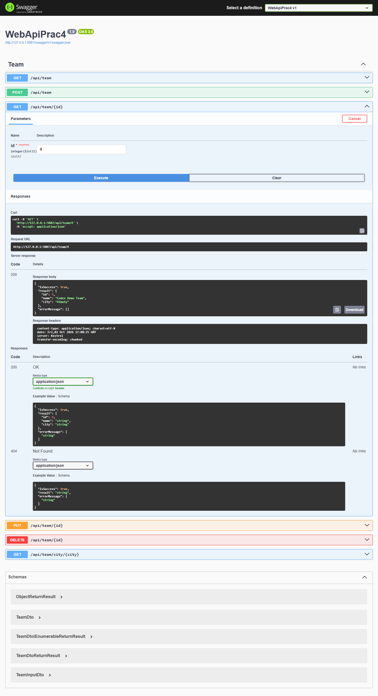
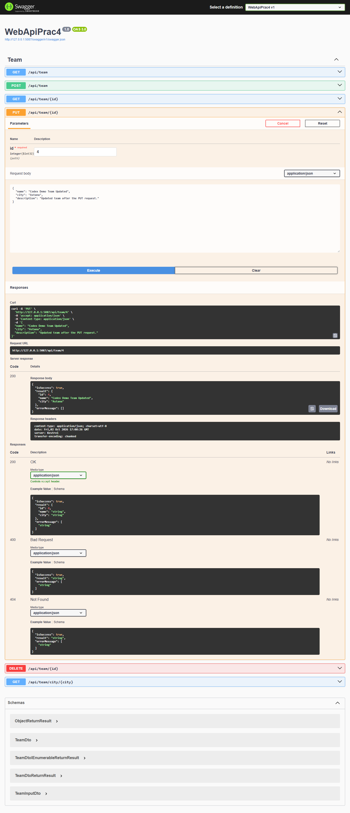
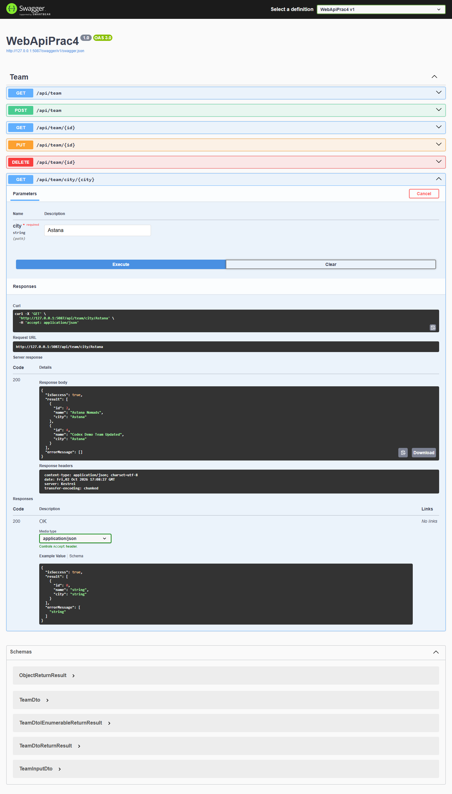
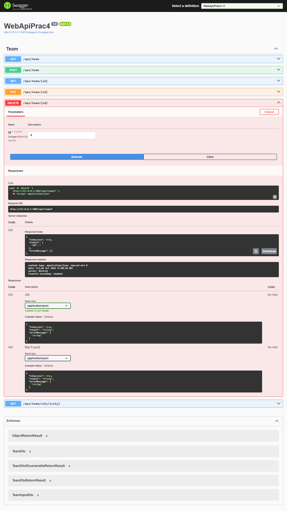
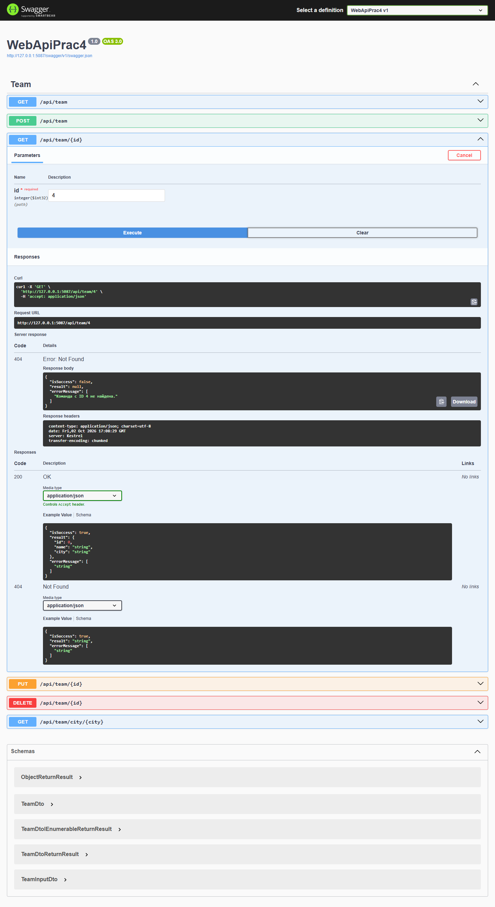
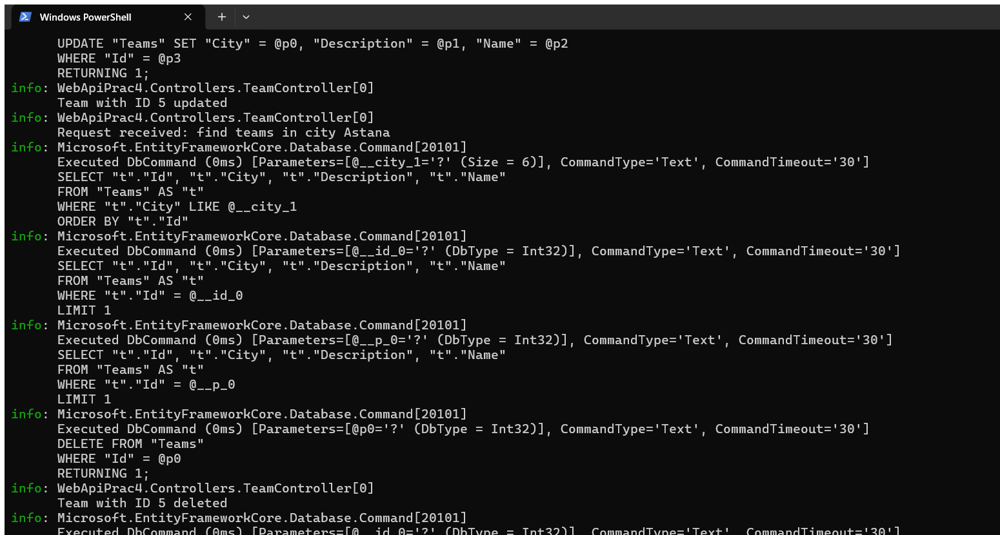

# Практическая работа — Модуль 04: Team API

**CSE5032 · Разработка веб-сервисов · Модуль 04**

Работа состоит из совместной и самостоятельной частей. В первой подготовлены Team, EF Core, контекст, Repository, DTO и AutoMapper, а также GET и POST. Самостоятельно я реализовал PUT, DELETE и поиск по городу. Контроллер обращается к Repository, тот использует EF Core; клиент получает DTO без Description, ответы оформляются как `ReturnResult`. Сейчас покажу полный сценарий управления командой и объясню путь данных до базы.

---

## Цель

Создать API команд и отработать полный путь от контроллера до базы данных, разделив совместную и самостоятельную части практики.

## Краткий отчёт

Модель `Team` сохраняется в SQLite через EF Core. `TeamRepository` изолирует доступ к `AppDbContext`; `TeamDto` отдаёт только `Id`, `Name`, `City`; AutoMapper выполняет преобразование. Все endpoint возвращают `ReturnResult<T>` и корректный HTTP-статус.

## Выполнение по шагам

### Часть 1. Совместная часть

| Шаг | Реализация | Для чего |
|---|---|---|
| 1. Entity | Создан `Team`: `Id`, `Name`, `City`, `Description` | Хранить сведения о команде |
| 2. EF Core | Добавлены `AppDbContext` и `DbSet<Team> Teams` | Связать модель с таблицей БД |
| 3. Конфигурация | Строка подключения к SQLite хранится в `appsettings.json`; контекст зарегистрирован через DI | Настроить доступ к БД отдельно от кода операций |
| 4. Repository | Созданы `ITeamRepository` и `TeamRepository` с асинхронными методами | Контроллеру не обращаться прямо к `DbContext` |
| 5. DTO и отображение | `TeamDto` содержит `Id`, `Name`, `City`; профиль использует `CreateMap<Team, TeamDto>().ReverseMap()` | Не возвращать `Description`; централизовать преобразование |
| 6. Общий ответ | Введён `ReturnResult<T>` | Унифицировать формат тела ответа |
| 7. Первая часть API | Добавлены GET списка, GET по Id и POST | Реализовать чтение и создание |

### Часть 2. Самостоятельно

| Шаг | Реализация | Для чего |
|---|---|---|
| 8. Изменение | `PUT /api/team/{id}` | Обновлять существующую команду |
| 9. Удаление | `DELETE /api/team/{id}` | Удалять команду |
| 10. Поиск | `GET /api/team/city/{city}` | Возвращать команды только заданного города |

## Модель и DTO

| Поле | Entity `Team` | `TeamDto` для ответа |
|---|---:|---:|
| `Id` | Да | Да |
| `Name` | Да | Да |
| `City` | Да | Да |
| `Description` | Да | Нет — поле скрыто от клиента |

## Endpoint

| Метод | Endpoint | Назначение | Результат |
|---|---|---|---|
| `GET` | `/api/team` | Список команд | `200 OK` |
| `GET` | `/api/team/{id}` | Команда по Id | `200 OK` / `404 Not Found` |
| `POST` | `/api/team` | Создать команду | `201 Created` / `400 Bad Request` |
| `PUT` | `/api/team/{id}` | Изменить команду | `200 OK` / `404 Not Found` |
| `DELETE` | `/api/team/{id}` | Удалить команду | `200 OK` / `404 Not Found` |
| `GET` | `/api/team/city/{city}` | Поиск по городу | `200 OK` со списком совпадений |

## Пример JSON

Тело запроса на создание включает описание:

```json
{
  "name": "Astana Tigers",
  "city": "Astana",
  "description": "Демонстрационная команда"
}
```

В объекте `result` ответа клиенту будут только `id`, `name` и `city`.

## Проверка и скриншоты

Снимки расположены рядом с теми шагами, которые они подтверждают.

### Шаг 1. Все операции в Swagger



### Шаг 2. Получение списка — `GET /api/team`



### Шаг 3. Проверка валидации — `POST /api/team` → 400



### Шаг 4. Создание — `POST /api/team` → 201


### Шаг 5. Чтение по Id — `GET /api/team/{id}`



### Шаг 6. Самостоятельная часть: обновление — `PUT /api/team/{id}`



### Шаг 7. Самостоятельная часть: поиск — `GET /api/team/city/Astana`



### Шаг 8. Самостоятельная часть: удаление





### Журнал EF Core



## Контрольные понятия

- **Entity** — объект предметной области, который хранится в базе.
- **DbContext / DbSet** — контекст EF Core и набор записей таблицы.
- **Repository** — слой, который отделяет контроллер от запросов к EF Core.
- **DTO** — ограниченная форма данных для клиента.
- **AutoMapper** — преобразует Entity и DTO по настроенному профилю.
- **ReturnResult** — единый формат тела ответа; HTTP-код при этом остаётся отдельным.

## Вывод

Выполнены обе части практики: базовые операции из совместной части и самостоятельные PUT, DELETE и поиск по городу. API проверен через Swagger.
